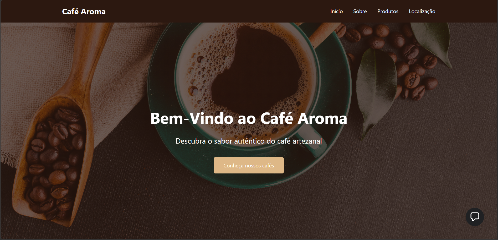
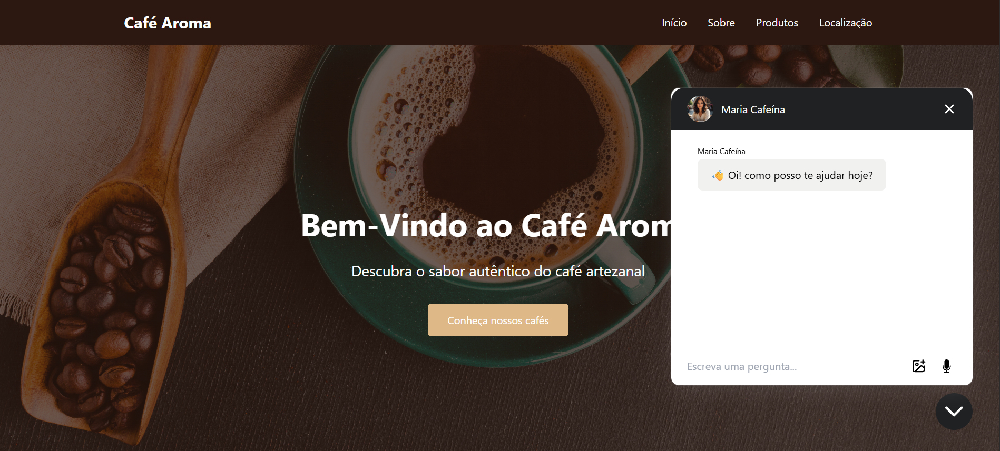

\# ☕ Café Aroma IA


<p align="center">

&nbsp; 

</p>


<h3 align="center">

Uma cafeteria virtual desenvolvida com HTML, CSS e JavaScript, integrada a uma atendente virtual com Inteligência Artificial.

</h3>


<p align="center">

A IA auxilia o usuário apresentando os cafés disponíveis, explicando suas características e proporcionando uma experiência de atendimento mais interativa.

</p>


<p align="center">

&nbsp; 

&nbsp; 

&nbsp; 

&nbsp; 

</p>


---


\# 📖 Sobre o Projeto


O \*\*Café Aroma IA\*\* é uma landing page desenvolvida para simular o site de uma cafeteria moderna, oferecendo uma experiência diferenciada através de uma \*\*assistente virtual baseada em Inteligência Artificial\*\*.


A atendente virtual conversa com o usuário, apresenta o cardápio, explica os tipos de café disponíveis e auxilia durante a navegação, tornando a interação mais natural e dinâmica.


Este projeto teve como objetivo praticar desenvolvimento Front-end e integração de recursos de IA em páginas web.


---


\# ✨ Funcionalidades


\- ☕ Catálogo de cafés;

\- 🤖 Atendente virtual com IA;

\- 💬 Explicação dos produtos;

\- 🎨 Interface moderna;

\- 📱 Layout responsivo;

\- ⚡ Navegação simples e intuitiva.


---


\# 📸 Preview


<p align="center">

&nbsp; 

</p>


---


\# 🚀 Tecnologias Utilizadas


\- HTML5

\- CSS3

\- JavaScript

\- Inteligência Artificial (Chatbot)


---


\# 📂 Estrutura do Projeto


```text

cafeteria-ia/

│

├── assets/

├── css/

├── js/

├── index.html

├── cafe-aroma.png

├── cafe-aroma-ia.png

└── README.md

```


---


\# ⚙️ Como executar


Clone este repositório:


```bash

git clone https://github.com/Henrique-Wandersee/cafeteria-agente-de-IA.git

```


Entre na pasta do projeto:


```bash

cd cafeteria-agente-de-IA

```


Abra o arquivo \*\*index.html\*\* diretamente no navegador.


Para uma melhor experiência durante o desenvolvimento, utilize a extensão \*\*Live Server\*\* do Visual Studio Code.


---


\# 🎯 Objetivos do Projeto


\- Desenvolver uma interface moderna para uma cafeteria;

\- Aplicar HTML semântico;

\- Construir layouts responsivos com CSS;

\- Utilizar JavaScript para interatividade;

\- Integrar uma atendente virtual com Inteligência Artificial;

\- Criar uma experiência mais dinâmica para o usuário.


---


\# 💡 Diferencial


O principal destaque deste projeto é a \*\*atendente virtual com IA\*\*, que atua como uma consultora da cafeteria, apresentando os cafés, explicando sabores, características e auxiliando o cliente durante a navegação.


Essa integração demonstra como recursos de Inteligência Artificial podem ser incorporados em aplicações Front-end para melhorar a experiência do usuário.


---


\# 👨‍💻 Autor


\*\*Henrique Wandersee\*\*


GitHub: https://github.com/Henrique-Wandersee


---


\# ⭐ Gostou do projeto?


Se este projeto foi útil ou serviu de inspiração, deixe uma ⭐ no repositório. Seu apoio incentiva o desenvolvimento de novos projetos!

